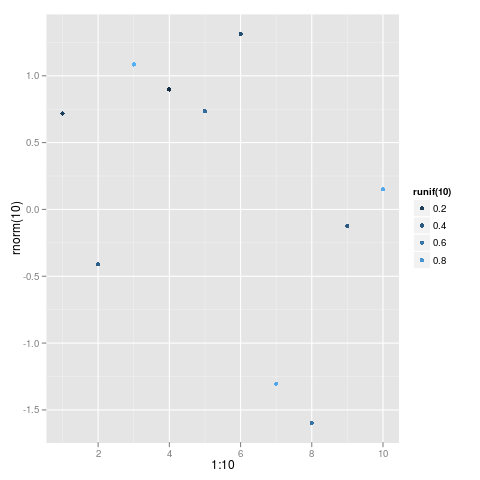

# Normal Distributions Functions in R

Density, distribution function, quantile function and random
generation for the normal distribution with mean equal to ‘mean’
and standard deviation equal to ‘sd’.

Use them this way:

```{r}
     dnorm(x, mean = 0, sd = 1, log = FALSE)
     pnorm(q, mean = 0, sd = 1, lower.tail = TRUE, log.p = FALSE)
     qnorm(p, mean = 0, sd = 1, lower.tail = TRUE, log.p = FALSE)
     rnorm(n, mean = 0, sd = 1)
```

The math behind the code:

$$latex  f(x) = \frac{1}{(\sigma\sqrt{2 \pi})} e^{-((x - \mu)^2/(2 \sigma^2))} $$


Ten random draws from the normal distribution:

```{r}
library(ggplot2)
qplot(1:10, rnorm(10), colour = runif(10))
```

Looks like:


